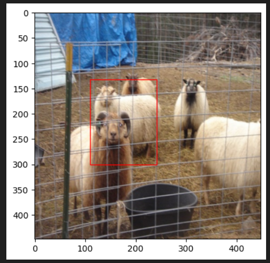

# Object Detection Project

This repository contains implementations of various object detection algorithms, including YOLOv1 (from scratch and with augmentation), Faster R-CNN, and DERT. These models are designed to detect and localize objects within images, each with its specific approach and architecture.

## Table of Contents

- [Introduction](#introduction)
- [Notebooks](#notebooks)
  - [DERT](#dert)
  - [Faster R-CNN](#faster-r-cnn)
  - [YOLOv1 Example](#yolov1-example)
  - [YOLOv1 From Scratch](#yolov1-from-scratch)
  - [YOLOv1 With Augmentation](#yolov1-with-augmentation)
- [Installation](#installation)
- [Usage](#usage)
- [Dataset](#dataset)
- [Training](#training)
- [Results](#results)
- [Contributing](#contributing)
- [License](#license)

## Introduction

Object detection is a fundamental task in computer vision that involves both detecting and localizing objects within images. In this repository, we provide implementations of several well-known object detection models using PyTorch and Jupyter Notebooks. The models include:

1. **YOLOv1**: An efficient real-time object detection model implemented from scratch.
2. **Faster R-CNN**: A region-based convolutional neural network for high-quality object detection.
3. **DERT**: An object detection transformer model that leverages transformer-based architecture for detection.

## Notebooks

### DERT

The `DERT.ipynb` notebook contains the implementation of the Detection Transformer (DERT) model, a transformer-based approach for object detection. The notebook demonstrates the usage of self-attention mechanisms in object detection, which is a recent innovation in the field.

### Faster R-CNN

The `Faster_R_CNN1.ipynb` notebook contains the implementation of the Faster R-CNN model, a two-stage object detection model. This model uses a Region Proposal Network (RPN) to generate proposals and then classifies these regions to detect objects.

### YOLOv1 Example

The `yolov1_example.ipynb` notebook provides a step-by-step guide on implementing YOLOv1. It covers how to construct the architecture, train the model, and evaluate its performance. This notebook is ideal for those who are new to the YOLO family of models.

### YOLOv1 From Scratch

The `yolov1_scratch.ipynb` notebook contains a complete implementation of YOLOv1 from scratch. This notebook provides insight into how YOLOv1 is constructed and trained, covering all major components, such as loss computation and model evaluation.

### YOLOv1 With Augmentation

The `yolov1_scratch_aug.ipynb` notebook extends the YOLOv1 implementation with various data augmentation techniques. Data augmentation is used to improve model generalization by applying transformations like rotation, flipping, and color jittering.

## Installation

### Prerequisites

- Python 3.7 or higher
- PyTorch 1.7.0 or higher
- CUDA (optional, for GPU acceleration)

### Steps

1. Clone the repository:

    ```sh
    git clone https://github.com/Dovanvu09/Object_Detection.git
    cd Object_Detection
    ```

2. Install dependencies:

    ```sh
    pip install -r requirements.txt
    ```

3. Install Jupyter notebook (optional):

    ```sh
    pip install jupyter
    ```

## Usage

### Running Notebooks

- To explore and run the models, start Jupyter Notebook:

    ```sh
    jupyter notebook
    ```

- Open any of the provided notebooks (e.g., `DERT.ipynb`) and execute the cells to explore the implementation and train the models.

### Training

- **YOLOv1**: Open either `yolov1_scratch.ipynb` or `yolov1_scratch_aug.ipynb` to train YOLOv1 from scratch or with data augmentation.
- **Faster R-CNN**: Use the `Faster_R_CNN1.ipynb` notebook to train and evaluate Faster R-CNN.
- **DERT**: Train the transformer-based model using `DERT.ipynb`.

### Testing

- You can test the trained models on new images using the relevant sections in the notebooks. These sections contain code to load an image, run inference, and visualize the detection results.

## Dataset

- The notebooks are designed to work with the Pascal VOC dataset or COCO dataset.
- Place the images in the `images/` directory and their corresponding labels in the `labels/` directory.

## Training

1. Prepare the dataset and ensure that the image and label directories are set up correctly.
2. Adjust hyperparameters such as learning rate, batch size, and epochs as required.
3. Execute the training cells in the respective notebooks.

## Results

- The YOLOv1 model, when trained from scratch, achieves a mean Average Precision (mAP) of approximately `0.65`.
- Faster R-CNN achieves a mAP of around `0.78` on the Pascal VOC dataset.
- The DERT model leverages transformer-based mechanisms to achieve competitive accuracy with a more modern approach.

**Sample output**:



## Contributing

Contributions are welcome! You can contribute in the following ways:

1. Fork the repository.
2. Create your branch:

    ```sh
    git checkout -b feature/your-feature
    ```

3. Commit your changes:

    ```sh
    git commit -m "Add some feature"
    ```

4. Push to the branch:

    ```sh
    git push origin feature/your-feature
    ```

5. Open a pull request.
## Contact

For any questions or issues, please contact me:

- Email: [vudo22555@gmail.com]

